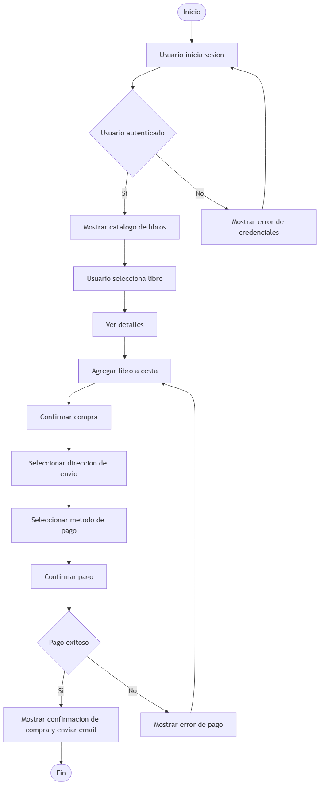
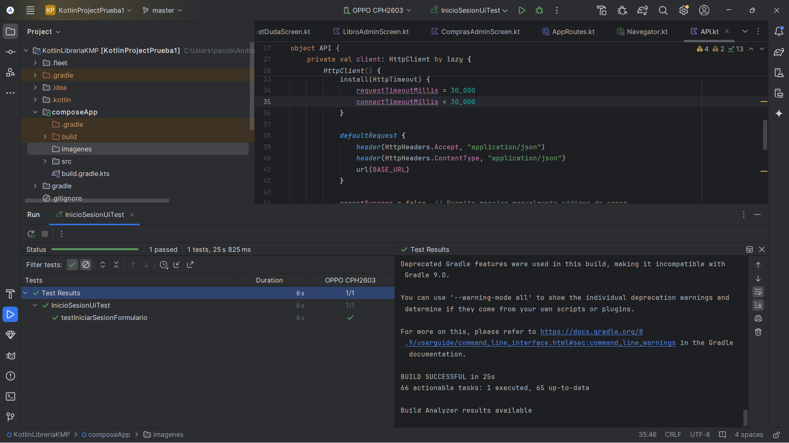

# LeafRead — Documento TFG

**Realizado por:**  
Francisco José Batista de los Santos  

---

## 📖 Índice

- [3. Introducción](#3-introducción)
  - [3.1 Expectativas y Objetivos](#31-expectativas-y-objetivos)
  - [3.2 Idea Inicial](#32-idea-inicial)
  - [3.3 Tecnologías a Utilizar](#33-tecnologías-a-utilizar)
  - [3.4 Antecedentes](#34-antecedentes)
- [4. Descripción](#4-descripción)
- [5. Instalación y Preparación](#5-instalación-y-preparación)
- [6. Prototipado](#6-prototipado)
- [7. Diseño Funcional](#7-diseño-funcional)
- [8. Desarrollo](#8-desarrollo)
- [9. Pruebas](#9-pruebas)
- [10. Distribución](#10-distribución)
- [11. Manual de Uso](#11-manual-de-uso)
- [12. Conclusiones](#12-conclusiones)
- [13. Bibliografía y Referencias](#14-bibliografía-y-referencias)

---

## 3. Introducción

### 3.1 Expectativas y Objetivos

El objetivo principal de este proyecto es desarrollar una aplicación multiplataforma compatible con sistemas **Android** y **escritorio (Windows/Linux)**, que permita a los usuarios la compra, valoración y exploración de libros según sus gustos, ofreciendo una experiencia fluida y multiplataforma.

### 3.2 Idea Inicial

La idea surge del interés por los libros en mi entorno y la falta de apps intuitivas y directas para gestionar valoraciones y compras.

### 3.3 Tecnologías a Utilizar

- **Front-end (App multiplataforma):** Compose Multiplatform
- **Lógica de negocio:** Kotlin Multiplatform Mobile (KMP)
- **Back-end:** API REST con Spring Boot
- **Base de datos:** MongoDB
- **Web embebida:** Glitch
- **Testing:** JUnit, Compose UI Test, Mock
- **Control de versiones:** Git y GitHub
- **Prototipado:** Figma

---

## 4. Descripción

### 4.1 Funcionalidades

- Registro y autenticación
- CRUD de libros
- Valoración de los libros
- Sincronización entre dispositivos
- Filtrado de catálogo
- Proceso de compra
- Personalización del avatar del usuario
- Direcciones controladas

### 4.2 Organización del Proyecto

Por fases:  
Planificación → Prototipado → Desarrollo modular → Pruebas → Documentación

---

## 5. Instalación y Preparación

### 5.1 Android

Desde Google Play Store (en entorno real).

### 5.2 Escritorio (Windows)

Desde la web oficiál de la libraría (en entorno real). 

### 5.3 Configuración Inicial

Solo será necesario registrarse o iniciar sesión para tener todos los apartados de la app disponibles.

### 5.4 Control de Versiones

Con **Git y GitHub**:

- Historial completo
- Commits organizados por funcionalidad

### 5.5 Configuración de Archivos y Dependencias

#### Estructura multiplataforma

- `commonMain`
- `androidMain`
- `desktopMain`
- `androidInstrumentedTest`

#### Dependencias destacadas

- Compose Multiplatform
- Ktor
- Moko
- Stripe-Android
- kotlinx-serialization-json

---

## 6. Prototipado

**Figma** como herramienta colaborativa:  
[Prototipo en Figma](https://www.figma.com/design/d5yVnbsP0XTDM58yEqbFN6/Figma-libreria?node-id=1-2&t=Oi1C7d9sEdZWQSqG-1)

---

## 7. Diseño Funcional

### Diagrama 
**Diagrama de flujo**  

---

## 8. Desarrollo

Iterativo e incremental.  
Fases: configuración → entidades → stock y compras → pruebas → despliegue.

**Dificultades:** despliegue en Render, sincronización multiplataforma.

---

## 9. Pruebas

- JUnit y Mock en back-end.
- Compose UI Test en front-end.
- Insomnia para APIs.

**Cobertura del 99% en unitarias**.
Se puede ver en el repositorio del back-end mas adelante.

**Pruebas de UI:** detección de mejoras en pantallas pequeñas.

---

## 10. Distribución

**API** → Render
**Web** → Glitch
**App Android** → APK desde Android Studio  
**Desktop** → Paquetes instalables

---

## 11. Manual de Uso

**Acciones comunes:** comprar libro, marcar favoritos, valorar, cerrar sesión.

**Características avanzadas:** gestión de stock, tickets, moderación de valoraciones, sincronización multi-dispositivo.

---

## 12. Conclusiones

Se cumplieron los objetivos iniciales, con limitaciones menores en el despliegue API.

**Mejoras futuras:**

- Mejorar despliegue API
- Funcionalidad offline escritorio
- Traducción multilenguaje
- Mejora del sistema de estadísticas

**Valoración personal:** 
En lo personal, este proyecto no solo me sirvió para reforzar conocimientos técnicos, sino que me ayudó a comprender mejor todo el paradigma que es la programación, la importancia de la organización, el control de versiones y la toma de decisiones en entornos de desarrollo reales. Me permitió también valorar las ventajas y retos de desarrollar para distintos entornos y dispositivos, y sobre todo, confirmar que esta área profesional me resulta apasionante.

---

## 13. Bibliografía y Referencias

- [Android Studio Docs](https://developer.android.com/studio)
- [Java Docs](https://docs.oracle.com/en/java/)
- [Kotlin Multiplatform Docs](https://kotlinlang.org/docs/multiplatform.html)
- [Render Docs](https://render.com/docs)
- [GitHub Docs](https://docs.github.com/en)
- Stack Overflow — consultas puntuales.

---

> Si quieres probar la app:
>
> - Clona los repositorios:
>   - [API_TFG_Libreria](https://github.com/fbatlos/API_TFG_Libreria.git)
>   - [KotlinLibreriaKMP](https://github.com/fbatlos/KotlinLibreriaKMP.git)
> - Contacto para feedback: *franciscobatista.dev@gmail.com*

---

